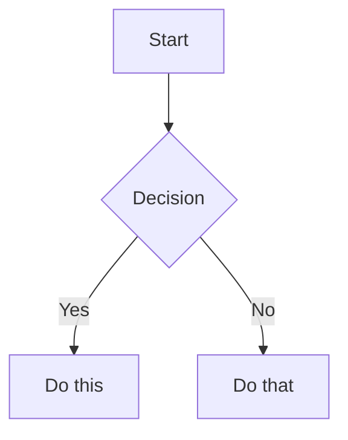

# Markdown Syntax Reference

Detailed syntax reference for GFM and Obsidian Markdown. **Default to GFM syntax** for GitHub compatibility; use Obsidian-only syntax only when targeting Obsidian exclusively.

> See also: `CALLOUTS.md` for alert/callout syntax, `EMBEDS.md` for embed syntax, `FRONT-MATTER.md` for frontmatter schemas.

---

## Links

### Standard GFM Links (Default — works on GitHub and Obsidian)

```markdown
[Display Text](note-name.md)               Link to another file
[Display Text](folder/note-name.md)        Link to file in subfolder
[Display Text](note-name.md#heading)       Link to a heading anchor
[Display Text](#heading-in-same-file)      Same-file heading link
[Display Text](https://example.com)        External URL
```

Heading anchors are lowercase, spaces replaced with hyphens, punctuation removed:
```markdown
[See Setup](#getting-started)              Links to ## Getting Started
```

### Obsidian Wikilinks (Obsidian-only — do NOT use for GitHub)

> Only use these if the file will never be viewed on GitHub.

```markdown
[[Note Name]]                              Link to note
[[Note Name|Display Text]]                 Custom display text
[[Note Name#Heading]]                      Link to heading
[[Note Name#^block-id]]                    Link to block
[[#Heading in same note]]                  Same-note heading link
```

---

## Tags

```markdown
#tag                    Inline tag (Obsidian only — renders as heading fragment on GitHub)
#nested/tag             Nested tag (Obsidian only)
```

> For GitHub, define tags in frontmatter only. Inline `#tags` are not a GitHub concept and may render oddly.

---

## Task Lists (GFM)

```markdown
- [x] Completed task
- [ ] Incomplete task
  - [ ] Nested task
```

Supported natively in both GitHub and Obsidian.

---

## Comments

```markdown
<!-- This is a standard HTML comment — hidden in both GitHub and Obsidian -->

This is visible %%but this is hidden%% text.    <!-- Obsidian only -->

%%
This entire block is hidden in Obsidian's reading view.
%%
```

Use HTML comments (`<!-- -->`) for cross-platform hidden content. `%%` comments are Obsidian-only.

---

## Highlighting

```markdown
==Highlighted text==      Obsidian only — renders as plain text on GitHub
<mark>Highlighted</mark>  HTML mark tag — works on GitHub and Obsidian
```

---

## Math (LaTeX)

Supported in both GitHub (since 2022) and Obsidian.

```markdown
Inline: $e^{i\pi} + 1 = 0$

Block:
$$
\frac{a}{b} = c
$$
```

---

## Diagrams (Mermaid)

Supported natively in both GitHub and Obsidian.

````markdown

````

To link Mermaid nodes to Obsidian notes, add `class NodeName internal-link;` (Obsidian only, ignored by GitHub).

---

## Footnotes

Supported in both GFM and Obsidian.

```markdown
Text with a footnote[^1].

[^1]: Footnote content.

Inline footnote.^[This is inline.]    <!-- Inline style: Obsidian only -->
```

---

## Compatibility Quick Reference

| Feature | GFM (GitHub) | Obsidian |
|---|---|---|
| `[text](file.md)` standard links | ✅ | ✅ |
| `[[wikilinks]]` | ❌ | ✅ |
| `> [!NOTE]` GFM alerts | ✅ | ✅ (maps to callout) |
| `> [!faq]-` foldable callouts | ❌ | ✅ |
| `` images | ✅ | ✅ |
| `![[embed]]` | ❌ | ✅ |
| YAML frontmatter | ✅ | ✅ |
| Inline `#tags` | ❌ | ✅ |
| `==highlight==` | ❌ | ✅ |
| `<mark>highlight</mark>` | ✅ | ✅ |
| `<!-- comment -->` | ✅ | ✅ |
| `%%comment%%` | ❌ | ✅ |
| Mermaid diagrams | ✅ | ✅ |
| Math (LaTeX) | ✅ | ✅ |
| Task lists | ✅ | ✅ |
| Footnotes `[^1]` | ✅ | ✅ |
